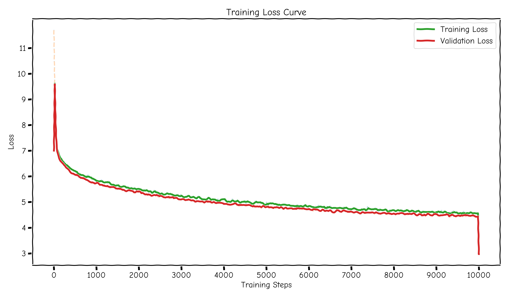

# PsyDuck (LLM From Scratch)

aaaaa i did a simple implementation of LLM(tbh it is small so SLM) ~60million parameters\
it is trained on the wiki103-v1 dataset\
(also i did some local training on a different dataset i will attach it below it is small so it is good to begin with)
```python
# Hyperparameters
batch_size = 16  # How many batches per training step
context_length = 128  # Length of the token chunk each batch
d_model = 256  # The size of our model token embeddings
num_blocks = 12  # Number of transformer blocks
num_heads = 8  # Number of heads in Multi-head attention
learning_rate = 3e-4  # 0.001
dropout = 0.1  # Dropout rate
max_iters = 10000  # Total of training iterations <- Change this to smaller number for testing
eval_interval = 50  # How often to evaluate
eval_iters = 20  # Number of iterations to average for evaluation
```
i used the kaggle notebook for training and it took me about ~1.5hrs of training\
you can look at the notebook [here](https://www.kaggle.com/code/yashrajrao/slm-v0-1-0).
### inference
```python
# on kaggle 
model.eval()
start = 'The world'
start_ids = enc.encode(start)
x = (torch.tensor(start_ids, dtype=torch.long, device=device)[None, ...])
y = model.generate(x, max_new_token=100)
print('---------------')
print(enc.decode(y[0].tolist()))
print('---------------')

# on local machine
import torch 
# from model import *
from model import LModel   # IMPORTANT
import tiktoken
from config import *

encoding  = tiktoken.get_encoding("cl100k_base")

model = LModel().to(device)
# model = torch.load("model-ckpt.pt")
model.load_state_dict(torch.load("model_60m_16022026.pt", map_location=device))
model.eval()

start = 'The'
start_ids = encoding.encode(start)
x = (torch.tensor(start_ids, dtype=torch.long, device=device)[None, ...])
y = model.generate(x, max_new_token=100, temperature=0.7, top_k=50)
print('---------------')
print(encoding.decode(y[0].tolist()))
print('---------------')
```
After the training and infrencing it i got the below ouput.\
Though it make no sense i am happy to see something working and giving out some output and it is interesting how the model works so far.
```text
---------------
The world was missing . The power is built as Penton , which is taken off , regularly open centre . In addition to initial economic growth , the western portions of love @-@ related soil strikes to the United States . In the same region the USADT Supernpling ceiling in Bangladesh , the Brillular Centre depended in a variety of homes that use a higher town . In addition , the average treeening of 11 @,@ 466 in Kerala , 14 @,@ 428 ( 7 @
---------------
```
## Training Loss



## refrences
[Build a Large Language Model (From Scratch)](https://github.com/rasbt/LLMs-from-scratch)\
[google](google.com)\
[kaggle](kaggle.com)\
[simple_dataset](https://huggingface.co/datasets/goendalf666/sales-textbook_for_convincing_and_selling/raw/main/sales_textbook.txt)

# knowledge
what we have right now is\
`FFN()`: this is the feed forward network\
the ffn is simple it has a
* linear layer that is (d_model -> 4 * d_model)
* ReLU()
* another linear layer (4 * d_model -> d_model)
* and a dropout layer **(to regularize and to prevent overfitting)**

`Attention()`: this is the single attention head that will be later used in\
this is the part where we make out knowledge base grow
so the purpose of the attention block is to allow each token in a sequence\
to dynamically focus on relavant past tokens while computing its representation.\
what the layer does\
the input X -> shape: (B, T, C)\
where:
* B = batch size
* T = sequence length(tokens)
* C = embedding dimension **(d_model)**

the attention layer computes a weighted combination of token info based on similarities between the tokens\
core idea is "which prev token is important to me"\
and we do that by
* query(Q) -> what this token is looking for
* key(K) -> what each token contains
* value(V) -> actual info to pass forward

so first we take linear projection
```python
q = self.q(x)
k = self.k(x)
v = self.v(x)
# input (B, T, C)
# output(B, T, head_size)
```
now we do scaled dot product\
weights = (q @ k.transpose(-2, -1)) * (1.0/ sqrt(d_k))\
here the 1/sqrt(d_k) is the scaling factor\
these weights compute the similarity btw the tokens.\
result shape(B, T, C)\
here each tell something like `how much token A is supposed to attend to token B.`\
the scaling we saw is to keep us on the ground we dont wanna fly off to trouble our softmax.\
now we mask the matrix we got\
the `self.tril` here the tril == triangle-lower this ensures a token can only attend to past tokens future tokens are blocked.\
now we softmax normalize the weigths matrix\
now this converts the similarities to probabilites\
at last we have the weights multiplied to the value

`MHA()`: the multihead-attention